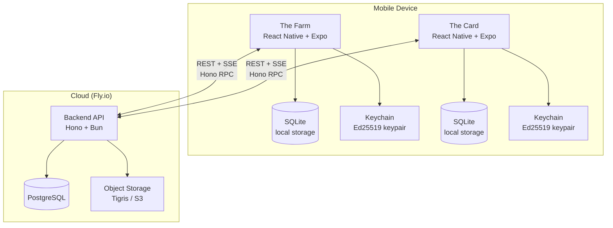

# Aura — System Architecture

> **Status:** Draft
> **Last updated:** 2026-07-25
>
> Builds on: ADR-002 (Farm/React Native), ADR-003 (Backend/Hono/Bun), ADR-004 (SQLite+PostgreSQL), ADR-005 (Ed25519 keypairs), ADR-006 (REST+SSE), ADR-007 (Fly.io)

---

## System Overview



**One device runs both Farm and Card.** Same keypair, same local SQLite. Farm writes attributions; Card reads feed. Both talk to the same backend.

---

## Components

### The Farm (Mobile App)

Local media studio. Captures camera feed, detects faces and gestures, attributes aura points.

| Layer | Technology | Purpose |
|-------|-----------|---------|
| Camera | `react-native-vision-camera` v4+ | Frame-level access for ML processing |
| Face detection | `@react-native-ml-kit/face-detection` | Detect faces in frame (no recognition in MVP) |
| Gesture recognition | Open-source visual computing lib (TBD) | Match hand movements to move library |
| Particle engine | Game engine overlay (TBD) | Render aura particles on camera feed |
| Local DB | SQLite (`expo-sqlite` / `op-sqlite`) | Recordings metadata, pending attributions, telemetry cache |
| File storage | Device filesystem | Video files, thumbnails |
| Identity | Ed25519 keypair in platform keychain | Signs attributions, proves recorder identity |
| State | Zustand | Lightweight client state |
| Navigation | `expo-router` | File-based routing |

**Offline-first.** Farm works without network. Attributions queue in SQLite, upload when connected.

### The Card (Mobile App)

Identity beacon and social feed. Users claim points, view reputation, react to feed items.

| Layer | Technology | Purpose |
|-------|-----------|---------|
| Identity | Ed25519 keypair in platform keychain | Same keypair as Farm (shared identity) |
| Local DB | SQLite (`expo-sqlite` / `op-sqlite`) | Claimed points, cached feed, profile |
| Feed UI | React Native + Reanimated | Chronological feed with quick reactions |
| State | Zustand | Lightweight client state |
| Navigation | `expo-router` | File-based routing |

**Offline-first.** Feed is cached locally. New claims queue until connected.

### Backend API (Server)

Validates attributions, delivers feeds, manages events. The shared source of truth.

| Layer | Technology | Purpose |
|-------|-----------|---------|
| Runtime | Bun | Fast startup, native TS, built-in SQLite for local dev |
| Framework | Hono | Ultralight, Web Standard-based, built-in Zod + RPC |
| Validation | Zod (shared via `@aura/shared`) | Single source of truth for API contracts |
| ORM | Drizzle | Type-safe, SQLite (dev) + PostgreSQL (prod) |
| Auth | Ed25519 signature verification | No sessions, no passwords — signature proves identity |
| Real-time | SSE (`GET /v1/feed/events`) | Push new attributions to connected Cards |
| Media | Tigris (S3-compatible, Fly.io native) | Recording storage, thumbnails |

**Stateless auth.** Every request carries an `Authorization` header with an Ed25519 signature. Backend verifies the signature against the public key. No sessions, no cookies, no token refresh.

### Shared Package (`@aura/shared`)

TypeScript package consumed by Farm, Card, and Backend.

| Content | Purpose |
|---------|---------|
| Zod schemas | API request/response types, attribution models, user profiles |
| TypeScript types | Inferred from Zod schemas |
| Validation functions | `isValidAttribution()`, `isValidPublicKey()` |
| Constants | Point values, move library definitions, API version |

---

## Data Flow

### 1. Telemetry Capture (Farm, On-Device)

```
Camera Frame
  → Face Detection (ML Kit) → face bounding boxes + vectors
  → Gesture Recognition (visual computing lib) → hand positions + velocity vectors
  → Move Library Match: does gesture pattern match a known move?
     ├── No match → discard (not notable)
     └── Match → activate particle generator ("spell")
         → Particles render on camera overlay (game engine)
         → Each particle = aura points attributed per time unit
         → Attribution recorded to local SQLite:
              { targetPublicKey, moveName, points, duration, timestamp, location, ip }
```

**Privacy:** Raw telemetry (face vectors, hand positions, IP, precise location) stays in local SQLite. Only the final attribution record (who got points, how many, for what move) is eligible for upload.

### 2. Attribution Upload (Farm → Backend)

```
Farm (Online)
  → Read pending attributions from local SQLite queue
  → Sign each attribution with recorder's Ed25519 private key
  → POST /v1/attributions
       Body: { attribution, recorderPublicKey, signature }
  → Backend verifies signature against recorderPublicKey
  → Backend stores attribution in PostgreSQL
  → Backend pushes to SSE feed subscribers
  → Farm marks attribution as "uploaded" in local SQLite

Farm (Offline)
  → Attributions accumulate in local SQLite queue
  → On reconnect: drain queue with exponential backoff retry
```

### 3. Validation (Backend)

```
Attribution Received
  → Signature verification (is recorder who they claim?)
  → Basic correlation (same-IP, temporal proximity) — P-5
  → Community consensus (confirm/challenge by others at event) — P-8
  → Status: pending → confirmed | challenged | rejected
```

**MVP (P-5):** Basic validation only — signature check + same-event correlation.
**Later (P-8):** Community validation — others at the event confirm or challenge.

### 4. Point Claiming (Card → Backend)

```
Card User
  → Views pending attributions addressed to their public key
  → Accepts or rejects each attribution
  → POST /v1/attributions/:id/claim
       Body: { publicKey, signature, action: "accept" | "reject" }
  → Backend verifies signature
  → Backend marks attribution as "claimed" or "rejected"
  → Claimed points added to user's total
```

### 5. Social Feed (Backend → Card)

```
Card (Online)
  → GET /v1/feed?cursor=... (paginated)
  → Backend returns feed items:
       { attributions, claims, reactions, sorted by time }
  → Card caches feed in local SQLite

Card (Offline)
  → Shows cached feed from local SQLite
  → On reconnect: GET /v1/feed/events (SSE) for new items
  → Merge new items into local cache
```

### 6. Quick Reactions (Card → Backend)

```
Card User
  → Reacts to feed item (emoji)
  → POST /v1/attributions/:id/reactions
       Body: { publicKey, signature, reaction: "🔥" }
  → Backend verifies signature
  → Backend stores reaction
  → Backend pushes reaction to SSE feed subscribers
```

---

## Database Schema (Logical)

### Tables

```
users
  public_key       TEXT PRIMARY KEY  (Ed25519, base58)
  display_name     TEXT
  avatar_url       TEXT              (optional, stored in object storage)
  created_at       TIMESTAMP

events
  id               UUID PRIMARY KEY
  name             TEXT
  created_by       TEXT REFERENCES users(public_key)
  location_lat     REAL
  location_lng     REAL
  started_at       TIMESTAMP
  ended_at         TIMESTAMP

attributions
  id               UUID PRIMARY KEY
  recorder_key     TEXT REFERENCES users(public_key)  (who recorded)
  target_key       TEXT REFERENCES users(public_key)  (who gets points)
  event_id         UUID REFERENCES events(id)        (optional)
  move_name        TEXT                                (e.g., "seesaw")
  points           INTEGER
  duration_seconds REAL
  note             TEXT                                (optional, recorder's message)
  location_lat     REAL
  location_lng     REAL
  ip_hash          TEXT                                (hashed IP for correlation, not raw)
  recorded_at      TIMESTAMP                           (when it happened)
  uploaded_at      TIMESTAMP                           (when Farm sent it)
  status           TEXT DEFAULT 'pending'              (pending | confirmed | challenged | rejected)
  claimed          BOOLEAN DEFAULT FALSE

validations
  id               UUID PRIMARY KEY
  attribution_id   UUID REFERENCES attributions(id)
  validator_key    TEXT REFERENCES users(public_key)
  action           TEXT                                (confirm | challenge)
  reason           TEXT                                (optional)
  created_at       TIMESTAMP

reactions
  id               UUID PRIMARY KEY
  attribution_id   UUID REFERENCES attributions(id)
  reactor_key      TEXT REFERENCES users(public_key)
  emoji            TEXT
  created_at       TIMESTAMP
```

### Indexes

```
attributions(target_key, recorded_at)   — feed queries
attributions(event_id, recorded_at)     — event timeline
attributions(ip_hash, recorded_at)      — correlation
validations(attribution_id)            — validation lookups
reactions(attribution_id)              — reaction counts
```

---

## Security & Privacy Architecture

### Principles

1. **Telemetry never leaves the device.** Face vectors, hand positions, raw IP, precise GPS — all stay in local SQLite. Only user-explicitly-shared attribution records cross the network.
2. **No PII on the server.** Backend stores public keys (not real names), hashed IPs (not raw), and user-chosen display names. No email, no phone, no real-world identity.
3. **Cryptographic proof, not trust.** Every action is signed. The backend verifies signatures; it doesn't trust claims.
4. **Community validation over central authority.** No single entity decides what's valid. Consensus emerges from people who were there.

### Threat Model

| Threat | Mitigation |
|--------|-----------|
| Spoofed attributions (fake recorder) | Ed25519 signatures — can't forge without private key |
| Sybil attacks (many fake identities) | Community validation (P-8), event presence correlation (P-7), anti-gaming heuristics (P-10) |
| Replay attacks | Nonce/timestamp in signed payload, server rejects duplicates |
| IP correlation abuse | IP hashed with event-specific salt, not stored raw |
| Key theft (device compromise) | Platform keychain (Secure Enclave on iOS, TEE on Android) |
| Key loss (user loses device) | Recovery phrase (BIP-39) at key creation — user prompted to back up |
| Mass point farming (collusion) | Community challenge mechanism, reputation weighting for validators |
| Privacy regulation (GDPR, biometric data) | On-device processing, user-controlled sharing, data deletion API |

### Data Boundaries

```
┌── On-Device (Private) ──────────────────────┐
│  Face vectors, hand positions               │
│  Raw IP address, precise GPS               │
│  Raw video/audio recordings                 │
│  Ed25519 private key                        │
│  Move library matching state                │
└─────────────────────────────────────────────┘
         │  User explicitly chooses to share
         ▼
┌── Network (Shared) ─────────────────────────┐
│  Attribution: { targetKey, move, points }   │
│  Hashed IP (for correlation)                │
│  Coarse location (event-level)              │
│  Ed25519 public key                         │
│  Display name, avatar (optional)            │
└─────────────────────────────────────────────┘
```

---

## Deployment

### Local Dev (Today)

```
M1 Pro (macOS 14.8.7)
├── Farm: Expo Go / iOS Simulator
├── Card: Expo Go / iOS Simulator
├── Backend: bun run dev (Hono + SQLite)
└── No cloud dependencies
```

### Production (P-5+)

```
Fly.io
├── Backend: Bun binary on Fly Machine (1-2 shared-cpu)
├── PostgreSQL: Fly Postgres (managed)
├── Media: Tigris (S3-compatible, Fly-native)
└── DNS: ifarm.club → Fly.io proxy
```

---

## Open Questions

| Question | When Resolved |
|----------|---------------|
| Visual computing library (face/hand tracking) | P-3 (Farm Core) |
| Game engine for particle rendering | P-3 (Farm Core) |
| Move library format and storage | P-3 (Farm Core) |
| Cross-device identity (same person, phone + tablet) | P-7 (Multi-Device) |
| Sync engine vs hand-rolled REST sync | P-7 (Multi-Device) |
| Recovery flow UX (seed phrase, social recovery) | P-8 (Community Validation) |
| Anti-gaming heuristics | P-10 (Scale & Hardening) |
